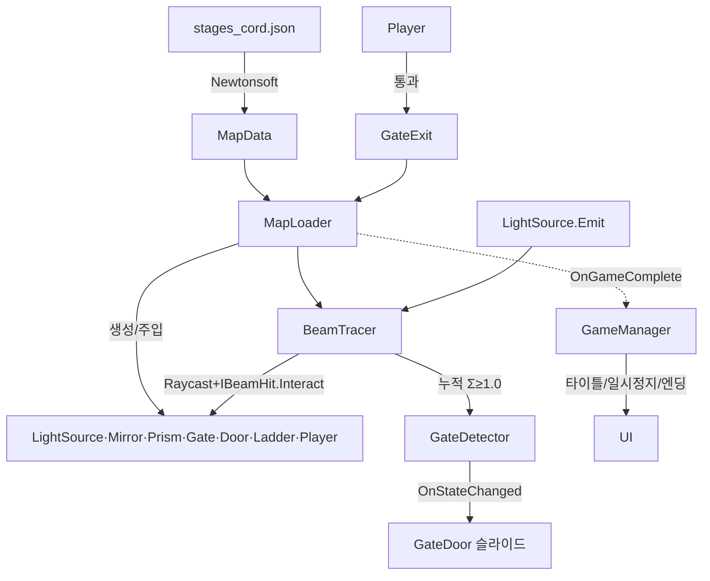

# 「별을 향해」 스크립트 상세 문서

> 2D 빛 반사 퍼즐 플랫포머 STAR의 전체 C# 스크립트 해설.
> 각 스크립트가 **무슨 역할**을 하고 **어떤 원리**로 작동하는지 파일별·멤버별로 정리한다.
> (개발 진행/로드맵은 `HANDOFF.md`, 아트 규격은 `Assets/Art/PREFAB_SPEC.md` 참고.)

---

## 0. 전체 아키텍처 한눈에

**설계 3원칙**
1. **데이터 주도**: 맵은 JSON(`Assets/Maps/*.json`). 코드는 좌표·각도를 읽어 배치만 한다.
2. **오브젝트별 독립 연산**: 거울·프리즘·수광부가 각자 `IBeamHit`를 구현해 자기 빛 상호작용을 처리. 빔 추적기는 위임만 한다.
3. **시각/로직 분리**: 콜라이더·로직은 오브젝트 루트에, 아트는 `"visual"` 자식에. 그래서 프리팹 아트를 코드 변경 없이 끼울 수 있다(프리팹 seam).

**폴더 구조와 역할**
```
Assets/Scripts/
  Data/     MapData.cs        JSON → C# 모델(Newtonsoft)
  Level/    GridMap.cs        그리드↔월드 좌표 + 화살표 방향 해석
            MapLoader.cs      ★맵을 읽어 모든 오브젝트를 생성·배치(중심 허브)
            GameManager.cs    타이틀→플레이→일시정지→엔딩 UI 상태머신
            ScreenFader.cs    스테이지 전환 페이드(검은 오버레이)
            CameraFollow.cs   플레이어 추적 카메라 + 레벨 경계 클램프
            GateExit.cs       스테이지 이동 트리거(게이트 통과/입장통로 역주행)
            AudioManager.cs   오디오 seam: 정적 SFX/BGM 훅(씬 컴포넌트, 클립 미할당이면 무음)
            ParallaxBackground.cs 배경 시차 스크롤(카메라 이동의 factor배만 따라감)
  Light/    Beam.cs           Beam 구조체 + IBeamHit 인터페이스
            BeamTracer.cs     빛 추적(스택 기반, 매 프레임) + LineRenderer 렌더
  Objects/  LightSource.cs    광원(랜즈): 빛 발사(Emitting=false면 미발사)
            Mirror.cs         거울: 반사(회전 가능)
            Prism.cs          프리즘: 분기(0.5+0.5)
            GateDetector.cs   게이트 수광부: 광량 누적·개방 판정
            GateDoor.cs       게이트 문: 열림/닫힘(위로 슬라이드)
            Ladder.cs         사다리: 등반 감지용 마커
            BeamTransparent.cs 마커: 이 콜라이더는 빛이 통과(발판)
            TorchMount.cs     횃불 랜즈 장착부: 장착/해제(발사 ON/OFF)
            LensItem.cs       바닥 랜즈 아이템: 줍기 대상 마커
  Player/   PlayerController.cs 이동·점프·사다리 등반
            MirrorInteractor.cs Q/E로 가까운 거울 회전
            LensInteractor.cs F로 랜즈 줍기/장착/해제
```

**핵심 규약(어기면 퍼즐이 깨짐)**
- 각도: `0°=동쪽(→)`, **시계방향(CW)**. 시각 회전은 `rotation_z = -angle_deg`.
- 좌표: `1셀 = 1유닛 = 40px`. 그리드 y = Unity y(**위로 증가, 반전 없음**).
- 반사·분기 결과 방향은 **22.5°의 배수**여야 유효.
- Unity 6.3 → Rigidbody2D는 `velocity` 대신 `linearVelocity`, 입력은 **신 Input System**(`Keyboard.current`)만.

**두 개의 큰 흐름**
```
[빛 흐름]  LightSource.Emit() → BeamTracer가 Raycast → 맞은 오브젝트의
           IBeamHit.Interact() 호출 → 이어질 빔을 스택에 push → 반복 →
           GateDetector가 누적 Σ≥1.0이면 개방

[게임 흐름] MapLoader.Start → GameManager(타이틀) → StartGame → Build(stage1)
           → 게이트 통과(GateExit) → GoToNext → Transition(페이드+Build) →
           … → 마지막 스테이지 → OnGameComplete → 엔딩 → 타이틀
```

---

## 1. Data / `MapData.cs`

**역할**: `stages_*.json`을 C# 객체로 역직렬화하는 순수 데이터 모델(Newtonsoft.Json 속성 매핑). 로직 없음.

- **`UnifiedData`**: 최상위. `unit`(단위 정보), **`StageOrder`(`stage_order`, 선택 — 진행 순서·개수 배열)**, `stages`(스테이지 딕셔너리, 키 `"stage1"`~). 스테이지 개수는 이 딕셔너리·`stage_order`로 결정되며 코드에 하드코딩되지 않는다.
- **`StageData`**: 한 스테이지의 전부.
  - `Grid`(W·H), `Camera`(스테이지별 카메라 오버라이드), `Source`(광원), `Prism`(없으면 null), `Gate`(수광부 위치), **`Background`**(배경 아트 인덱스, −1=미지정→순번 사용).
  - `Mirrors`·`Platforms`·`Decoys`·`Ladders` 리스트, `Spawn`/`ExitSpawn`(정/역방향 스폰), `GateOpenZone`(문 칸들), `WallTransmit`(빛 통과 벽), `Entrance`(좌측벽 구멍), `Terrain`(열→높이).
  - **지형 타입(신규)**: `TerrainType`(`"x,y"→"grass"|"dirt"|"indoor"` 칸별 오버라이드)·`TerrainTypeDefault`(미지정 칸 기본, 기본값 `"dirt"`). 지형 **위치**는 여전히 `Terrain`(열→높이)이 정하고, 이건 **칸별 시각 타입만** 지정.
  - **랜즈 아이템(신규)**: `LensItem`(`[x,y]`, 바닥에 떨어진 시작 랜즈 위치. null=없음).
  - **`[JsonExtensionData] Extra`**: 매핑 안 된 나머지 JSON 키를 통째로 수집. `wall`, `wall_x25`, `wall_x41` 등 스테이지마다 이름이 다른 벽 키를 유연하게 처리하기 위한 장치.
  - **`AllWalls()`**: `Extra`에서 `"wall"`로 시작하는 모든 키를 훑어 벽 셀 좌표를 열거. → 벽 키 이름이 무엇이든 전부 벽으로 취급.
- **하위 모델**: `GridData`, `CameraSettings`(view_cells·fit_width·pad), `Endpoint`(pos+dir 화살표 **+ `HasLens`** 기본 true), `GateData`(pos + **`OpenDir`** 열림 방향), `PrismData`(in/out 방향·fixed), `MirrorData`(id·pos·angle_deg·fixed), `PlatformData`(cells·transmit·MISSING), `DecoyData`, `LadderData`(col·y_span).

**원리 노트**: `transmit` 기본값이 `true`(발판은 기본 빛 투과), `MISSING`은 미설계 발판 스킵 플래그. `Endpoint.HasLens` 기본 `true`(=기존 맵은 랜즈 장착 상태). JSON에 없는 필드는 C# 기본값을 쓴다.

---

## 2. Level / `GridMap.cs`

**역할**: 좌표계·방향 변환 유틸(정적 클래스). 상태 없음.

- **`CELL = 1.0f`**: 1셀 = 1유닛 상수.
- **`ToWorld(gx,gy)` / `ToWorld(int[])`**: 그리드 좌표 → 월드 좌표(y 반전 없음).
- **`DirToVector(arrow)`**: 화살표 문자열(`→ ← ↑ ↓ ↗ ↖ ↘ ↙`)을 **정규화된 방향 벡터**로. 대각선은 `.normalized`로 길이 1. 광원 방향·프리즘 출력 방향 주입에 쓰인다.

---

## 3. Light / `Beam.cs`

**역할**: 빛의 최소 단위와 상호작용 계약.

- **`struct Beam`**: `origin`(시작점), `dir`(정규화 방향 — 생성자가 `.normalized`), `intensity`(세기). 값 타입이라 스택에 담아 GC 없이 다룬다.
- **`interface IBeamHit`**: `Interact(incoming, hitCenter, outgoing)`. 빛과 상호작용하는 오브젝트가 구현해 **자기 연산**을 수행하고, 이어질 빔을 `outgoing`에 추가한다.
  - 거울 → 반사광 1개, 프리즘 → 분기광 2개, 수광부 → 추가 없음(흡수) + 누적.
  - **이 인터페이스 덕분에 새 광학 오브젝트를 추가해도 BeamTracer는 수정 불필요.**

---

## 4. Light / `BeamTracer.cs`

**역할**: 빛을 실제로 추적하고 `LineRenderer`로 그린다. 판정은 물리 Raycast, 상호작용은 각 오브젝트에 위임.

- **`LateUpdate() → Trace()`**: **매 프레임 재추적**. 물리 갱신 뒤(LateUpdate)라 플레이어 등 움직이는 차폐물의 최신 위치가 반영된다. 거울을 돌리면 다음 프레임에 자동 반영(별도 호출 불필요).
- **`Trace()`** — 핵심 알고리즘:
  1. `queriesStartInColliders=false`(시작점이 자기 콜라이더 안이어도 무시), `queriesHitTriggers=false`(사다리 Trigger는 빛 통과), `SyncTransforms()`.
  2. 모든 `GateDetector.BeginFrame()`으로 누적만 0 초기화(상태·색은 유지).
  3. `Emitting`인 `LightSource.Emit()`을 **스택에 push**(초기 광선). **미발사(랜즈 미장착) 광원은 건너뜀.** 소스/게이트는 `??=`로 1회만 검색해 캐시(토글은 캐시된 객체의 `Emitting`을 매 프레임 확인).
  4. **스택 루프**(프리즘 분기 때문에 스택 기반):
     - 빔을 pop → 깊이 초과면 스킵.
     - **투과 스캔**: `Raycast`가 맞은 콜라이더가 `IBeamHit`이 없고 `BeamTransparent`가 있으면(=발판) 그 지점 조금 너머로 전진해 다시 Raycast(같은 발판 재검출 방지). 광학 오브젝트/벽을 만날 때까지 반복.
     - 아무것도 없으면 최대 길이까지 직선 세그먼트 추가.
     - `IBeamHit`이면: **오브젝트 중심으로 스냅**(격자 정합) → 세그먼트 추가 → `Interact()` 호출 → 나온 빔들을 스택에 push.
     - 그 외(벽)면 히트 지점까지 세그먼트 추가하고 정지.
  5. 모든 `GateDetector.Commit()`으로 개폐 확정(엣지 트리거).
  6. `Render(segments)`.
- **`Render()`**: `LineRenderer` 풀을 재사용(GC 억제). 세그먼트 수만큼 켜고 나머지는 끈다.

**원리 노트**: 세그먼트를 **오브젝트 중심(collider.transform.position)** 으로 스냅하는 게 핵심 — 실제 히트점이 아니라 격자 중심을 이어 붙여야 반사가 깔끔하게 22.5° 배수로 유지된다. 재사용 버퍼(`_segments`/`_stack`/`_outgoing`)로 매 프레임 할당을 없앴다.

---

## 5. Objects / `LightSource.cs`

**역할**: 랜즈/광원. 고정 방향으로 빛 1개를 발사. 콜라이더 없음(빛 시작점).

- **`Init(dir, intensity)`**: 방향(정규화)·세기 주입.
- **`Emitting`**(bool, 기본 true): 발사 여부. **false면 `BeamTracer`가 이 광원을 건너뛴다**(랜즈 미장착 = 빔 없음). `TorchMount`가 장착/해제로 토글.
- **`Emit()`**: 현재 위치·방향·세기로 `Beam`을 만들어 반환. BeamTracer가 매 프레임 호출(단 `Emitting`인 광원만).

---

## 6. Objects / `Mirror.cs`

**역할**: 거울. 입사광을 각도 기반으로 **1회 반사**. 회전 가능(플레이어가 Q/E) 또는 고정.

- **필드**: `angleDeg`(현재 각), `solutionAngle`(정답 각 — 랜덤/정렬 기준), `isFixed`, `visualAngleOffset`(아트 기본각 보정).
- **`Init(solutionAngle, isFixed, offset)`**: 정답 각을 저장하고 현재 각=정답으로 시작, 시각 회전 적용.
- **`RandomizeFromSolution(maxSteps)`**: 회전 가능한 거울을 정답에서 **±(22.5°×랜덤 steps)** 로 틀어 놓는다. **22.5° 배수로만** 어긋나므로 Q/E로 반드시 정답 도달 가능. 고정 거울은 무시.
- **`SnapToSolution()`**: 현재 각=정답으로 즉시 정렬(P키 정답 정렬용).
- **`Interact()`**: `Reflect(입사방향)` 한 개를 outgoing에 추가(세기 보존).
- **`Rotate(steps)`**: 22.5°씩 회전(고정이면 무시). 플레이어 조작.
- **`Reflect(d)`**: 반사식 `n=(cosθ,−sinθ)`, `r = d − 2(d·n)n`. **`angleDeg`를 반사면의 법선 각으로** 해석. 결과 정규화.
- **`ApplyVisualRotation()`**: `"visual"` 자식을 `rotation_z = -angle + visualAngleOffset`로 회전. **반사 연산과 별개** — 아트를 세로로 그렸을 때(offset=90) 보이는 방향만 보정하고 반사각은 그대로.

**원리 노트**: 반사 연산은 `angleDeg`만 쓰고 `visualAngleOffset`은 시각에만 쓴다 → 아트 방향을 바꿔도 퍼즐이 안 깨진다. 런타임 회전은 `angleDeg`를 바꾸므로, 시각 보정이 `ApplyVisualRotation`에 들어 있어야 회전 후에도 유지된다.

---

## 7. Objects / `Prism.cs`

**역할**: 프리즘(고정). 입사광을 여러 방향으로 **분기**하고 에너지를 균등 분배.

- **`Init(outDirections)`**: 맵 데이터의 출력 화살표들을 방향 벡터로 저장.
- **`Interact()`**: `share = 입사세기 / 출력수`(2방향이면 0.5씩). 각 출력 방향으로 `Beam`을 outgoing에 추가.

**원리 노트**: 게이트는 두 분기의 세기를 **합산**(Σ)해야 1.0에 도달 → "두 갈래를 모두 성립시켜야 개방"이라는 퍼즐 규칙이 여기서 나온다.

---

## 8. Objects / `GateDetector.cs`

**역할**: 게이트 수광부. 도달 광량 Σ≥`threshold`를 **일정 시간(`chargeTime`, 기본 1.2s) 유지**하면 개방(충전식). 빛을 흡수(이어지는 빔 없음). **상태에 따른 색 변경 없음 — 단일 아트**(#8), 진행은 임시 게이지로 표시.

- **`Interact()`**: 입사 세기를 `_acc`에 누적만.
- **`BeginFrame()`**: 재추적 시작 시 누적만 0으로(충전·상태 유지).
- **`Commit()`**: 이번 프레임 `lit`(Σ≥threshold)이면 `_charge += dt`, 아니면 `-= dt`(0~chargeTime 클램프). `_charge`가 가득 차면 개방. **`latchOnOpen`(기본 true)**: 완전히 열린 순간 **래치** → 이후 빛이 가려져도(플레이어가 빔을 막든 반사가 깨지든) **열린 상태 유지**(충전 감소 없음). 래치 전에는 빛이 끊기면 충전이 줄어 닫힐 수 있음. **엣지 트리거** `OnOpen`(1회)·`OnStateChanged(bool)`. 래치는 스테이지 재빌드(전환·R) 시 새 컴포넌트라 초기화.
- **`ChargeFraction`**(0~1): 충전 비율. **`SetGauge(fillPivot)`**: 게이지 채움 피벗을 등록하면 `Commit`마다 그 x 스케일을 `ChargeFraction`으로 갱신(왼쪽 정렬로 차오름).

**원리 노트**: `BeginFrame`→매 프레임 `Interact`→`Commit`의 3단계는 그대로. 개방 판정만 "순간 Σ≥1"에서 "**Σ≥1을 chargeTime 동안 유지**"로 바뀌었다(빛을 잠깐 스쳐도 안 열림). `Time.deltaTime`을 쓰므로 일시정지(timeScale 0)엔 충전이 멈춘다. 게이지는 임시 시각화 — 나중에 수광부 아트 일부를 투명으로 두고 그 뒤 단색 게이지를 채우는 효과로 교체 예정.

---

## 9. Objects / `GateDoor.cs`

**역할**: 게이트 개폐부(문). 수광부가 열리면 **지정 방향으로 천천히 슬라이드**해 통로를 뚫고, 닫히면 원위치로 돌아와 막는다. 열림 방향은 맵 `gate.open_dir`(기본 ↑), 이동거리는 개폐존 크기에서 자동.

- **필드**: `slideDuration`(여닫이 시간), **`openSortingOffset`**(열림 시 정렬순서에 더할 값, 기본 −20 → 아트 뒤로 가려짐), `_blocker`(콜라이더), `_visual`(SpriteRenderer), `_door`(움직일 Transform), `_closedPos`(닫힘 위치), **`_slideVec`**(열릴 때 이동 벡터=방향×거리), `_sprites`/`_baseOrders`(정렬순서 조정용).
- **`Register(col, sr, slideOffset)`**: MapLoader가 문 블럭·**이동 벡터**를 등록. 닫힘 위치·대상 Transform·모든 SpriteRenderer의 기본 정렬순서 기억.
- **`ApplySorting(open)`**: 열림이면 모든 문 스프라이트 정렬순서에 `openSortingOffset`을 더해 **다른 아트 뒤로**, 닫힘이면 원복.
- **`SetOpenImmediate(open)`**: 연출 없이 즉시 상태·위치·정렬 적용(최초 배치용).
- **`SetOpen(open)`**: 수광부 `OnStateChanged` 구독 대상. 상태 변화 시 즉시 정렬 적용 + 슬라이드 코루틴 시작. **열림은 즉시 콜라이더 해제**(움직이는 중에도 통과), **닫힘은 다 돌아온 뒤 콜라이더 활성**.
- **`Slide(open)`**: from→to(`_closedPos + _slideVec` 또는 원위치)로 위치·색 Lerp. 이동 벡터 크기에 비례해 시간을 잡아 중간에 뒤집혀도 속도 일정.

**원리 노트**: 문이 비켜나 있어도 콜라이더가 꺼져 있어 빔 추적에 안 걸린다. 열림 시 정렬순서를 내려 미끄러져 들어가는 쪽 아트(벽·천장 등)에 자연스럽게 가려진다.

---

## 10. Objects / `Ladder.cs` · `BeamTransparent.cs` · `TorchMount.cs` · `LensItem.cs`

- **`Ladder`**: 등반 통로 마커. `height`만 보관. 실제 등반 로직은 `PlayerController`. 콜라이더는 Trigger라 빛은 통과.
- **`BeamTransparent`**: 빈 마커 컴포넌트. 발판(transmit=true)에 붙어 "이 솔리드 콜라이더는 빛이 통과"를 표시. `BeamTracer`가 이 마커를 보고 히트를 건너뛴다. 벽은 이 마커가 없어 빛을 막는다.
- **`TorchMount`**: 횃불의 랜즈 장착부(랜즈 아이템화 스테이지에만 부착). `Init(source, lensVisual, mounted)`로 광원·랜즈 시각·초기 장착 상태를 받는다. `SetMounted(bool)`/`Toggle()` = **장착 시 `LightSource.Emitting=true`+랜즈 시각 표시 / 해제 시 false+숨김**. 플레이어의 `LensInteractor`가 F로 호출.
- **`LensItem`**: 바닥에 떨어진 시작 랜즈(줍기 대상) 마커. `Taken` 플래그 + `Take()`(획득 시 비활성). 트리거 콜라이더는 `MapLoader.BuildLensItem`이 붙이고, 실제 획득(F키)은 `LensInteractor`가 처리.

---

## 11. Level / `MapLoader.cs` (중심 허브)

**역할**: 맵 JSON을 읽어 **모든 오브젝트를 생성·배치·변수 주입**한다. "무엇을 어디에 어떤 각도로"만 책임지고, 상호작용은 각 오브젝트에 맡긴다. 씬의 빈 GameObject에 붙어 있다.

### 11.1 인스펙터 필드(요약)
- 맵/스테이지: `mapFile`, `stageKey`, `stageOrder`.
- 게임 플로우: `useGameFlow`(타이틀 사용), `showTitleOnBoot`, `OnGameComplete`(엔딩 콜백), `IsTransitioning`.
- 편의 키: `restartKey`(R), `debugStageKeys`(1~4), `autoSolveKey`(P) — **데모 빌드 시 디버그 키들 끌 것**.
- 카메라: `followPlayer`, `cameraViewCells`.
- 게이트: `gateExitInset`(통과 판정을 안쪽으로 넓히는 정도).
- 아트: `artScale`(표시 배율, 기본 2 — **콜라이더·판정 불변, 보이는 크기만**).
- 거울: `mirrorArtAngleOffset`(아트 기본각 90), `randomizeMirrors`, `mirrorRandomSteps`(2=±45°).
- 프리팹 슬롯 **21종**(비면 색 사각형 폴백). 지형 3종(`terrainGrass/Dirt/Indoor` + 공통 폴백 `terrainPrefab`), 거울 거치대 2종(`mirrorMountPrefab` 바닥 / `mirrorMountCeilingPrefab` 천장 10×80) 포함.
- **`stageBackgrounds`**(배경 프리팹 **배열**): 스테이지 수만큼 채운다. 인덱스 = 맵 `background`(있으면) 또는 stageOrder 순번. 비면 배경 없음.
- 상수: `Z_*`(정렬순서), `PLATFORM_*`(발판 기하 — 윗면을 칸 위 모서리 y+0.5에 맞춰 지형과 높이 일치).

### 11.2 생명주기
- **`Start()`**: **`ApplyStageOrderFromMap()`**(맵의 `stage_order`로 `stageOrder` 확정 — StartGame이 `stageOrder[0]`을 쓰기 전에) 후, `useGameFlow`면 `GameManager.Bootstrap(this)`(타이틀부터), 아니면 `buildOnStart`로 즉시 Build.
- **`ApplyStageOrderFromMap()`**: mapFile을 파싱해 `stage_order`가 있으면 `stageOrder`에 반영(인스펙터 값은 폴백). Build에서도 파싱 후 동일 적용. → **스테이지 개수·순서를 맵이 결정**, 씬 인스펙터 수정 불필요.
- **`Update()`**: 전환/일시정지/타이틀(ControlsLocked) 중엔 무시. `R`=Restart, `P`=SolveAllMirrors, `1~4`=GoToIndex.
- **진행상태 저장/복원**(다른 맵 갔다 와도 이어짐): `_progress`(stageKey→거울 각도·게이트 개방·랜즈 장착). **`CaptureProgress`**가 스테이지를 떠나기 직전(Clear 전) 현재 상태를 저장하고, Build가 새 stageKey의 `_restore`를 로드해 BuildMirrors/BuildGate/BuildLens가 그대로 복원한다. 미방문이면 정방향=랜덤·역방향=정답. `Restart`=그 스테이지 진행 폐기(+`_skipCapture`), `StartGame`=전체 초기화. **메모리 저장(파일 아님)**.
- **`Build()`** — 핵심 절차:
  1. `mapFile` 파싱 → 스테이지 찾기(실패 시 에러 로그).
  2. **떠나는 스테이지 진행 저장**(`CaptureProgress`) + 새 스테이지 `_restore` 로드 → `Clear()` + `_mirrors.Clear()` + `Level_{stageKey}` 루트 생성.
  3. **비광학**: BuildTerrain → Walls → Platforms → Ladders.
  4. **광학**: BuildLens → Mirrors → Prism → Gate.
  5. 기타: Decoys → **BuildLensItem**(바닥 랜즈) → Entrance(역주행 트리거) → Spawn → Player.
  6. `BeamTracer` 생성 후 1회 `Trace()`(에디트 모드 미리보기 포함).
  7. `randomizeMirrors`면 **`EnsureUnsolvedStart`**: 랜덤이 우연히 게이트를 열면 닫힌 배치가 나올 때까지 재추첨(최대 20회) → 항상 "안 풀린 상태"로 시작.
  8. `SetupCamera`.
- **`Clear()`**: `Level_`로 시작하는 자식(=레벨 전체)을 파괴. GameUI·ScreenFader는 별도 루트라 안 지워짐.

### 11.3 스테이지 전환
- **`GoToNext()`**: 다음 스테이지로. **마지막이면** `OnGameComplete`(엔딩) 호출, 플로우 미사용 시 stageOrder[0]로 순환(폴백).
- **`GoToPrev()`**: 이전 스테이지로(첫 스테이지면 무시). 입장 통로 역주행 시.
- **`StartGame()`**: 타이틀에서 첫 스테이지부터 빌드(GameManager가 호출).
- **`Restart()`**: 현재 스테이지 재구축(거울 재추첨·플레이어 리셋).
- **`GoToIndex(i)`**: 디버그 즉시 이동.
- **`Transition(next, reverse)`**(코루틴): ControlsLocked 잠금 → 페이드 아웃 → `_reverseEntry` 세팅 → stageKey 교체 → Build → 한 프레임 대기 → 페이드 인 → 잠금 해제. 전환의 유일한 연출 경로.
- **`EffectiveSpawn(s)`**: 역주행이면 `exit_spawn`(출구쪽), 아니면 `spawn`(입장 통로).

### 11.4 거울 퍼즐 보조
- **`SolveAllMirrors()`**: `_mirrors`(회전 가능 거울)를 전부 `SnapToSolution()`. 빛은 다음 프레임 자동 재추적.
- **`EnsureUnsolvedStart(tracer)`**: 시작 배치가 정답이면 거울을 다시 랜덤화(최대 20회). 충전식 게이트는 빌드 시점에 아직 안 열리므로(`IsOpen=false`) **즉시 광량 `GateDetector.IsLit`으로 "정답 배치"를 판정**한다.

### 11.5 비광학 배치
- **`BuildBackground`**: `stageBackgrounds[인덱스]`를 레벨 중앙에 배치하고 모든 SpriteRenderer를 `Z_BACKGROUND`(−100) 기준으로 맨 뒤로. 인덱스=맵 `background`(≥0) 또는 stageOrder 순번. 슬롯 비거나 범위 밖이면 배경 없음(폴백). Build에서 지형보다 먼저 호출. **프리팹에 `ParallaxBackground`가 없으면 루트에 기본 factor(`backgroundParallax`)로 하나 부착**(시차 스크롤).
- **`BuildTerrain`**: `terrain` 딕셔너리(열→높이)로 0..높이 칸을 솔리드 타일로 채움. **칸마다 `TerrainTypeAt`(terrain_type 오버라이드 → 기본 dirt)로 타입을 정해 `TerrainStyle`이 잔디/땅/실내 프리팹·색 선택**(타입 슬롯 비면 `terrainPrefab`, 그것도 비면 색 사각형). `fitToScale`로 1×1칸에 정확히 맞춤(이웃과 연결). 빛 차단은 벽 담당.
- **`BuildWalls`**: `AllWalls()` 순회. `entrance` 칸은 벽 생략(구멍). `wall_transmit` 칸은 반투명 + `BeamTransparent`(빛만 통과). 나머지는 불투명 벽(빔 정지).
- **`BuildPlatforms`**: 발판 셀마다 얇은(0.4) 솔리드. **윗면을 y+0.5로 올려 지형과 높이 일치**(`PLATFORM_CY`). `transmit`면 파랑 + `BeamTransparent`, 아니면 남색(빛 차단). `fitToScale`로 가로 1칸 정합.
- **`BuildLadders`**: `y_span`으로 사다리 세로 구간 계산. **지형이 채운 칸은 건너뛰어 땅 위에만** 생성. Trigger 콜라이더(0.6×h) + `Ladder`. 프리팹은 `BuildLadderSegments`로 1칸 조각 반복.

### 11.6 광학 배치
- **`BuildLens`**: 광원 생성 + `LightSource.Init`. **`source.has_lens`로 `Emitting` 결정**(false면 시작 시 빔 없음). **횃불(`torchPrefab`)을 바닥에 세움**(`PlaceOnSurface`, 랜즈 유무와 무관하게 항상). 랜즈 시각(`"visual"`)은 **장착 시에만 표시**. `lens_item`이 있는 스테이지면 `TorchMount`를 붙여 F 장착/해제 활성화, 없으면 랜즈 고정(현행). 색 사각형 모드에선 장착 시 방향 표시 점 추가.
- **`BuildLensItem`**: `lens_item`이 있으면 그 칸에 트리거 콜라이더(0.7×0.7) + `LensItem` 마커 + 랜즈 시각 배치(줍기 대상).
- **`BuildMirrors`**: 거울마다 솔리드 루트 + `"visual"`. 아트 기본각 보정은 프리팹에만. `Mirror.Init(정답각)` 후 `randomizeMirrors`면 랜덤화. 회전 가능한 것만 `_mirrors`에 등록. **거치대**: `SurfaceBelow`/`SurfaceAbove`로 위·아래 중 **가까운 지지면**을 골라 `PlaceOnSurface` — 아래=바닥 거치대(세움), 위=천장 거치대(전용 아트면 정립, 없으면 바닥 아트를 뒤집어 폴백).
- **`BuildPrism`**: 프리즘 루트 + 시각(45°는 플레이스홀더 마름모용) + `Prism.Init(출력방향들)`.
- **`BuildGate`**: 수광부 루트 + 시각(**단일 아트, 1칸 `fitToScale`, 색 피드백 없음**) + `GateDetector` + **`BuildGateGauge`(임시 충전 게이지)** 등록. 이어 `BuildGateDoor`·`BuildGateExit`. **역주행(`_reverseEntry`)이면 `det.PresetOpen()`**(즉시 개방·래치) + 문도 열린 채 배치.
- **`BuildGateGauge`**: 수광부 위에 배경 바 + 채움 바 생성. 채움 피벗을 왼쪽 끝에 두어 x 스케일로 왼쪽 정렬 차오름 → `GateDetector.SetGauge`가 매 프레임 갱신. **`MakeSprite`**(색 사각형 자식 생성) 헬퍼 사용.
- **`BuildGateExit`**: 개폐존 바운딩 박스로 Trigger 생성. **얇은 축(통로 방향)을 그리드 중심 쪽으로 `gateExitInset`만큼 확장** → 표면에 붙기 전/붙은 채로도 통과 판정. `GateExit.Init(det, this, +1)`.
- **`BuildEntrance`**: 입장 통로에 역방향 Trigger(`GateExit.Init(null, this, -1)`) → 왼쪽으로 나가면 이전 스테이지.
- **`BuildGateDoor`**: 개폐존을 **하나의 긴 블럭**(콜라이더 1 + 시각 1)으로. 프리팹은 `InstantiateGateDoor`로 존에 맞춤(가로형 90° 회전). **`gate.open_dir`(기본 ↑)로 열림 벡터 계산**(세로 이동=존 높이·가로 이동=존 폭) → `door.Register(box, sr, 벡터)` + `SetOpenImmediate(false)` + 수광부 `OnStateChanged` 구독.

### 11.7 기타 배치
- **`BuildDecoys`**: 가짜 광학 표식(45° 마름모).
- **`BuildSpawn`**: 스폰 표식(선택). `EffectiveSpawn` 위치.
- **`BuildPlayer`**: 스폰에 플레이어 액터 생성. BoxCollider(0.6×0.9, 마찰0·모서리라운딩)+Rigidbody2D(중력3)+`PlayerController`(리스폰 경계 주입)+`MirrorInteractor`+`LensInteractor`(`carryVisualPrefab=lensPrefab` 주입). 카메라 추적용 Transform 반환.

### 11.8 시각/프리팹 유틸 (프리팹 seam의 핵심)
- **`SolidRoot`**: 솔리드 콜라이더 루트(시각은 자식으로 분리).
- **`Decor` / `SolidDecor`**: 순수 시각 / 시각+솔리드 오브젝트. `prefab`·`fitToScale`를 하위로 전달.
- **`Visual(색)`**: 1×1 흰 텍스처로 색 사각형 `"visual"` 자식 생성(플레이스홀더 기본 경로).
- **`Visual(프리팹, …)`**: 프리팹 있으면 인스턴스화, 없으면 색 사각형 폴백. `fitToScale`면 `InstantiateFitted`, 아니면 `InstantiatePrefab`. **반환 SpriteRenderer는 게이트 색 피드백 호환용.**
- **`InstantiatePrefab`**: 프리팹을 `"visual"` 자식으로. 회전 적용 + **`artScale` 표시 배율** 적용 + sortingOrder=기준+내부 상대순서.
- **`InstantiateFitted`**: 타일용. 원본 크기 무관하게 **지정 칸 크기에 정확히 맞춤**(배율 미적용 — 이웃과 빈틈·겹침 없이 연결).
- **`InstantiateGateDoor`**: 문용. 원본 무관하게 **개폐존에 맞춤**, 가로형 존은 90° 눕혀 재사용.
- **`BuildLadderSegments`**: 1칸 조각을 세로로 h개 쌓음(균일 스케일 → 비율 유지, 늘어나지 않음).
- **`PlaceOnSurface`**: 부속 아트(횃불·거치대)를 원본 크기(×artScale)로 지지면에 배치. `ceiling=false`면 **밑면이 아래 지지면**에, `ceiling=true`면 **윗면이 위 지지면(천장)**에 닿도록. `flip=true`면 세로 반전(바닥 아트를 천장에 재사용할 때).
- **`SurfaceBelow`**: 지정 칸에서 아래로 가장 가까운 지지면(지형 t+0.5 / 발판 cy+0.5)의 윗면 y. 없으면 NaN.
- **`SurfaceAbove`**: 지정 칸에서 위로 가장 가까운 발판의 아랫면 y(천장). 없으면 NaN. (거울 거치대의 바닥/천장 자동 판별에 사용)
- **`Square`**: 1×1 흰 스프라이트(정적 캐시). 모든 색 사각형의 원본.

### 11.9 카메라
- **`SetupCamera`**: `followPlayer`면 직교 크기(view_cells 또는 fit_width로 가로 폭)·경계(pad 포함) 계산 후 `CameraFollow.Configure`. 아니면 `FrameCamera`(전체 프레이밍 폴백).
- **`FrameCamera`**: 그리드 전체가 보이도록 중앙·직교크기 세팅.
- **`DestroySafe`**: 플레이 중 `Destroy` / 에디터 `DestroyImmediate` 자동 선택.

**원리 노트**: MapLoader는 "생성만" 한다. 로직은 각 오브젝트가, 빛은 BeamTracer가, UI는 GameManager가 담당 → 관심사가 깔끔히 분리된다.

---

## 12. Level / `GameManager.cs`

**역할**: 게임 흐름(타이틀→플레이→일시정지→엔딩) UI 상태머신. **코드로 Canvas/Text를 자체 생성** → 씬 세팅·프리팹·EventSystem 불필요, 키보드 구동.

- **`Bootstrap(loader)`**(정적): `GameUI` 오브젝트 생성(DontDestroyOnLoad), `OnGameComplete` 구독, UI 생성, 타이틀(또는 바로 시작) 진입. MapLoader.Start가 호출.
- **`Update()`**: "아무 키" 안내문 명멸(unscaled 시간) + 진입 쿨다운 처리 후, 상태별 입력 — 타이틀/엔딩=아무 키, 플레이=ESC 일시정지, 일시정지=ESC 계속/R 재시작/T 타이틀.
- **상태 전이**: `EnterTitle`/`StartGameFromTitle`/`EnterPause`/`ResumeFromPause`/`RestartFromPause`/`QuitToTitle`/`HandleGameComplete`/`EndingToTitle`. 각 전이가 `Time.timeScale`(일시정지·엔딩=0)·`ControlsLocked`·표시 패널을 세팅.
- **UI 생성**: `BuildUI`(Canvas + CanvasScaler + 3패널), `MakePanel`(전체화면 배경 + CanvasGroup), `MakeText`(레거시 Text), `Switch`(한 패널만 활성 + 페이드 인), `FadeIn`(unscaled 시간이라 timeScale=0에서도 동작), `UIFont`(맑은 고딕 등 OS 폰트 동적 로드 → 한글 렌더).

**원리 노트**: 일시정지는 `timeScale=0`(물리 정지) + `ControlsLocked`(입력 차단) 이중. 재시작 시 `timeScale=1` 복구 후에야 전환 페이드가 진행된다(0이면 코루틴 멈춤). 안내문 명멸·페이드가 `unscaledTime`이라 정지 중에도 살아 있다.

---

## 13. Level / `ScreenFader.cs`

**역할**: 스테이지 전환용 전체화면 검은 페이드. 스스로 ScreenSpaceOverlay Canvas + Image 생성, DontDestroyOnLoad라 레벨 Clear에 안 지워짐.

- **`Create()`**(정적): 최상단(sortingOrder=short.MaxValue) 검은 Image 생성.
- **`SetAlpha(a)`** / **`Fade(from,to)`**(코루틴): duration 동안 알파 보간. MapLoader.Transition이 아웃/인에 사용.

---

## 14. Level / `CameraFollow.cs`

**역할**: 2D 직교 플레이어 추적 카메라. 부드럽게 따라가고 레벨 밖은 안 보이게 클램프.

- **`Configure(target, min, max)`**: 대상·경계 주입 + 첫 프레임 튐 방지 스냅.
- **`LateUpdate()`**: `target==null`이면 무동작(레벨 Clear로 플레이어가 사라져도 안전). `SmoothDamp`로 추적.
- **`Clamp(p)`**: 뷰가 레벨보다 크면 그 축은 중앙 고정, 아니면 경계 안으로 클램프.

---

## 15. Level / `GateExit.cs`

**역할**: 스테이지 이동 트리거. `dir +1`(게이트 통과, 개방 상태에서만) 또는 `dir −1`(입장 통로 역주행, 조건 없음).

- **`Init(gate, loader, dir)`**: 게이트(null이면 무조건)·로더·방향 주입.
- **`OnTriggerEnter2D` / `OnTriggerStay2D` → `TryPass`**: 게이트가 있으면 개방 상태에서만, 플레이어면 `GoToNext`/`GoToPrev`. **Stay도 판정**하는 이유: 문에 붙어 있는 동안 게이트가 열려도(재진입 없이) 통과되게. 중복 호출은 `_transitioning` 가드가 막는다.
- **`_armed` + `DisarmIfOverlaps`**: 새 스테이지에서 플레이어가 트리거 **위에 스폰**되면 즉시 되돌아가는 **전환 오실레이션**이 생긴다 → MapLoader가 빌드 직후 겹친 트리거를 무장 해제(`_armed=false`)하고, 플레이어가 한 번 **밖으로 나가면(OnTriggerExit) 재무장**. 정상 진입(스폰이 트리거 밖)은 처음부터 무장 상태라 영향 없음.

---

## 16. Player / `PlayerController.cs`

**역할**: 플레이어 액터 — 좌우 이동·가변 점프·사다리 등반. 신 Input System.

- **정적 `ControlsLocked`**: 전환/일시정지/타이틀/엔딩 중 입력·이동 정지(여러 스크립트가 공유하는 게이트).
- **`Awake`**: Rigidbody 세팅(회전 고정·보간·연속 충돌), 접지 필터(트리거=사다리 제외).
- **`Update`**: 점프 눌림/뗌(에지)·좌우 "나중에 누른 방향"(SOCD last-wins)만 기록. 실제 이동은 FixedUpdate.
- **`FixedUpdate`**: ControlsLocked면 완전 정지. 경계 밖이면 리스폰. 사다리 위 상하 입력이면 등반(중력 0·수직 이동). 아니면 지상/공중 이동 + **가변 점프**(상승 중 버튼 떼면 감쇠) + **코요테 타임**(발판 이탈 직후 잠깐 점프 허용) + **하강 중력 가중**(낙하 빠르게, 정점 3.5칸 유지).
- **`SetRespawn`**: 스폰·경계 주입(MapLoader). **`Respawn`**: 스폰 복귀(보간 리셋으로 잔상 방지). **`IsGrounded`**: 발밑 Cast(법선 위쪽만). **`OnTriggerEnter/Exit`**: 사다리 겹침 카운트.

**원리 노트**: 점프 물리는 정점 높이(3.5칸)에서 초기 속도를 역산(`v0=√(2gh)`). 상승엔 손 안 대고 하강에만 중력을 키워 "정점은 유지하되 낙하는 빠른" 손맛.

---

## 17. Player / `MirrorInteractor.cs`

**역할**: 플레이어의 거울 조작기. 반경 안 가장 가까운 **회전 가능(비고정)** 거울을 흰색 하이라이트 → `Q`(반시계)/`E`(시계) 22.5° 회전.

- **`Update`**: ControlsLocked면 무시. `UpdateSelection` 후 Q/E로 `Mirror.Rotate`. 빛은 BeamTracer가 매 프레임 재추적하므로 별도 호출 불필요.
- **`UpdateSelection`**: 모든 Mirror 중 비고정·반경 내 최근접 선택.
- **`Select`**: 이전 선택 색 복원 후 새 선택의 `"visual"` 하위 첫 SpriteRenderer를 하이라이트(프리팹 아트도 호환).
- **`OnDisable`**: 하이라이트 원복.

---

## 18. Player / `LensInteractor.cs`

**역할**: 플레이어의 랜즈 조작기(랜즈 아이템화 스테이지에서만 의미). `F`키 **문맥 감응**: ①반경(기본 2.5칸) 안 횃불이 있으면 장착/해제 토글 ②아니면 겹친 바닥 랜즈를 줍기.

- **`Update`**: ControlsLocked면 무시. `F` 눌림 시 — `NearestMount`가 있으면 그 `TorchMount`를 토글(**장착 시 소지 소모, 해제 시 회수**), 없고 `_touching`(겹친 `LensItem`)이 있고 미소지면 `Take()`로 줍기. 그때마다 `UpdateCarryVisual`.
- **`NearestMount`**: 반경 내 최근접 `TorchMount`(F 누른 순간에만 검색).
- **`UpdateCarryVisual`**: 소지 중이면 `carryVisualPrefab`(=`lensPrefab`) 사본을 머리 위에 표시(정렬순서 +20). 프리팹 없으면 표시 없음.
- **`OnTriggerEnter/Exit2D`**: 바닥 `LensItem`과의 겹침을 `_touching`에 기록(플레이어 몸 콜라이더 vs 아이템 트리거).

**원리 노트**: `Emit` 게이팅은 `LightSource.Emitting`이, 시각(랜즈 표시)은 `TorchMount`가 담당하므로, 이 조작기는 "언제 토글하느냐"만 안다. 빔은 `BeamTracer`가 매 프레임 재추적하므로 토글 즉시 다음 프레임에 반영된다. 다른 스테이지엔 `TorchMount`/`LensItem`이 없어 F가 무반응(현행 동작 보존).

---

## 19. Level / `AudioManager.cs`

**역할**: 오디오 seam(로드맵 3의 오디오 절반). 코드 곳곳의 이벤트가 **정적 메서드**를 호출하면 재생한다. **씬에 이 컴포넌트를 두고 클립 슬롯을 채우면 소리가 나고, 컴포넌트가 없거나 슬롯이 비면 조용히 무시**(프리팹 seam과 동일 철학) → 최종 오디오 교체(로드맵 7) 시 슬롯만 채우면 호출부 변경 0.

- **`I`**(정적 인스턴스): `Awake`에서 등록 + `DontDestroyOnLoad`(전환 간 유지, 중복 파괴). BGM/SFX용 `AudioSource` 2개를 코드로 부착.
- **클립 슬롯**: BGM(`bgmTitle`·`bgmPlay`·`bgmEnding` + `bgmVolume`), SFX(`sfxMirrorRotate`·`sfxGateOpen`·`sfxStageTransition`·`sfxJump`·`sfxLand`·`sfxLensPickup`·`sfxLensMount`·`sfxLensUnmount` + `sfxVolume`).
- **정적 API**(전부 null-safe): `MirrorRotate()`·`GateOpen()`·`StageTransition()`·`Jump()`·`Land()`·`LensPickup()`·`LensMount()`·`LensUnmount()`, BGM은 `PlayBgm(Bgm.Title|Play|Ending)`(같은 곡이면 안 끊음).
- **훅 위치**: 거울 회전=`MirrorInteractor`, 게이트 개방=`GateDoor.SetOpen(true)`, 전환=`MapLoader.Transition`, 점프/착지=`PlayerController`(착지는 공중→접지 에지), 랜즈 줍기/장착/해제=`LensInteractor`, BGM 3종=`GameManager`(EnterTitle/StartGameFromTitle/HandleGameComplete).

**원리 노트**: 호출부는 `AudioManager.GateOpen()`처럼 정적으로 부르고 인스턴스 유무는 내부에서 판단(`I == null`이면 무시). 그래서 씬에 오디오를 안 넣어도 게임은 그대로 동작하고, 넣으면 소리만 붙는다.

---

## 20. Level / `ParallaxBackground.cs`

**역할**: 배경 시차(parallax) 스크롤. 카메라 이동량의 **`factor`배만큼만** 배경을 따라 움직여 원근감을 만든다.

- **`factor`**(0~1): 0=월드 고정(안 따라감) · 1=화면 고정(카메라와 완전 동행). **원경일수록 1에 가깝게**.
- **`LateUpdate`**: 첫 프레임에 자기 시작 위치·카메라 시작 위치를 기억 → 이후 `위치 = 시작 + (카메라이동)×factor`.
- **다층 시차**: 배경 프리팹의 레이어(자식)마다 이 컴포넌트를 붙여 factor를 달리하면 근경/원경이 다른 속도로 움직인다. 프리팹에 하나도 없으면 `MapLoader.BuildBackground`가 루트에 `backgroundParallax` 기본값으로 하나 붙인다.

**원리 노트**: 시차로 배경이 카메라를 부분 추종하므로, 배경 아트는 **그리드 전체가 아니라 화면+드리프트 여유**만 덮으면 된다(factor가 1에 가까울수록 적게 움직여 더 작은 아트로 충분). `CameraFollow`가 카메라를 움직인 뒤 읽히도록 둘 다 `LateUpdate`(1프레임 지연은 무시할 수준).

---

## 부록 A. 데이터 흐름 요약



## 부록 B. "누가 무엇을 책임지나" 빠른 표

| 관심사 | 담당 스크립트 |
|---|---|
| 맵 데이터 파싱 | `MapData` |
| 좌표·방향 변환 | `GridMap` |
| 오브젝트 생성·배치·아트 | `MapLoader` |
| 빛 추적·렌더 | `BeamTracer` (+ `Beam`/`IBeamHit`) |
| 광학 연산 | `LightSource`·`Mirror`·`Prism`·`GateDetector` |
| 게이트 문 개폐 | `GateDoor` |
| 스테이지 이동 | `GateExit` → `MapLoader.GoTo*` |
| 플레이어 조작 | `PlayerController`·`MirrorInteractor`·`LensInteractor` |
| 랜즈 획득·장착(빔 게이팅) | `LensInteractor`·`TorchMount`·`LensItem` (+ `LightSource.Emitting`) |
| 카메라 | `CameraFollow` (+ `MapLoader.SetupCamera`) |
| 게임 흐름·UI | `GameManager` (+ `ScreenFader`) |
| 오디오(SFX·BGM) | `AudioManager` (각 이벤트 스크립트가 정적 호출) |
